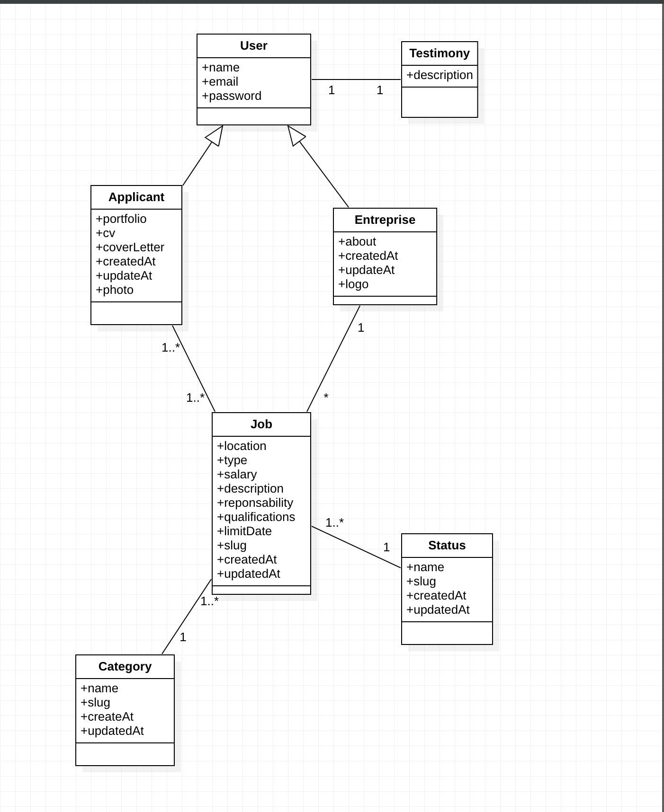

# JobEntry

## Table of Contents

- [Description](#description)
- [Installation](#installation)
- [Usage](#usage)
- [Contributing](#contributing)
- [License](#license)
- [Project Status](#project-status)
- [Contact](#contact)

## Description

This is a simple job entry application that allows users to create, read, update, and delete job entries.

## Installation

1. Clone this repository
2. Run `composer install`
3. Run `npm install`
4. Run `php artisan migrate`
5. Run `npm run dev`
6. Run `php artisan serve`
7. Navigate to `localhost:8000` in your browser
8. Enjoy!

## Usage

### Enterprise User
1. Register a new user as an enterprise on `localhost:8000/register`
2. Login with your new user credentials on `localhost:8000/login`
3. Create a new job entry on `localhost:8000/job/create`
4. View your job entry on `localhost:8000/job`
5. Edit your job entry on `localhost:8000/job/edit`
6. View all your job entries on `localhost:8000/dashboard`
7. Logout

### Job Seeker User
1. Register a new user as a job seeker on `localhost:8000/register`
2. Login with your new user credentials on `localhost:8000/login`
3. View all job entries on `localhost:8000/jobs`
4. View a specific job entry on `localhost:8000/job/{id}`
5. Apply to a job entry on `localhost:8000/job/{id}/apply`
6. View all job entries you have applied to on `localhost:8000/dashboard`
7. Logout

## Contributing

Pull requests are welcome. For major changes, please open an issue first to discuss what you would like to change.

## License

[MIT](https://choosealicense.com/licenses/mit/)

## Project Status

Project is: _in progress_ until further notice. The following features are planned:

- [ ] Add a job search feature
- [ ] Add a job application feature
- [ ] Add a job interview feature
- [ ] Add a job offer feature
- [ ] Add a job rejection feature
- [ ] Add a job acceptance feature
- [ ] Add a job completion feature
- [ ] Add a job archive feature
- [ ] Add a job search feature

## Contact

[GitHub](https://github.com/esse-jacques-dansomon/)

[LinkedIn](https://www.linkedin.com/in/esse-jacques-dansomon/)
